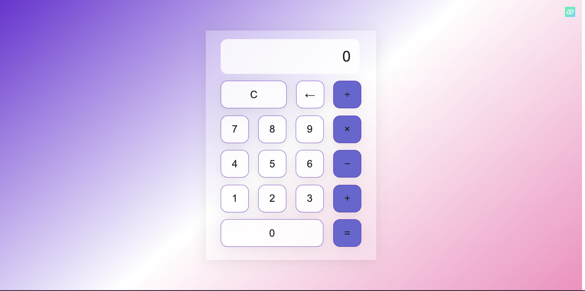

# Calculator

This is a simple calculator web application built with HTML, CSS, and JavaScript. It allows users to perform basic arithmetic calculations such as addition, subtraction, multiplication, and division.  
Deploy 👉 https://malibucalculator.netlify.app/ 

## Features

- Basic arithmetic operations: Addition, subtraction, multiplication, and division.
- Clear button (C): Resets the calculator's state.
- Backspace button (←): Deletes the last digit entered.
- Equal button (=): Computes the result of the expression.
- Responsive design: The calculator adapts to different screen sizes.

## Demo

You can try out the calculator by visiting the [live demo](https://your-demo-link.com).

## Getting Started

To run the calculator locally, follow these steps:

1. Clone the repository: `git clone https://github.com/your-username/calculator.git`
2. Open the project folder.
3. Open the `index.html` file in a web browser.

## Usage

1. Click on the calculator buttons to enter numbers and perform operations.
2. The current expression and result will be displayed in the screen section.
3. Use the clear button (C) to reset the calculator.
4. Use the backspace button (←) to delete the last digit entered.
5. Press the equal button (=) to compute the result.

## Contributing

Contributions are welcome! If you find any issues or have suggestions for improvements, please feel free to open an issue or submit a pull request.

## License

This project is licensed under the [MIT License](LICENSE).

